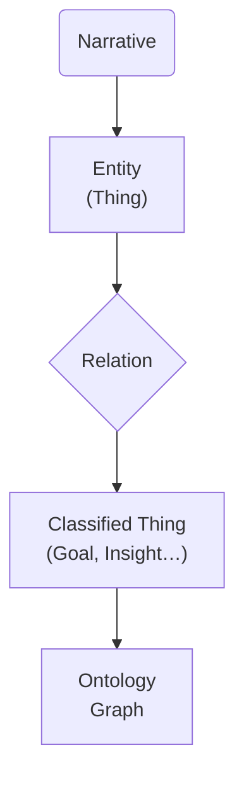

# CLAUDE.md

This file provides guidance to **Claude Code** (`claude.ai/code`) when working with code and documentation in this repository.

---

## Repository Purpose

This repo contains the code‑first implementation of the **Dotwork "Narrative‑to‑Ontology" Workspace**. The project helps product teams transform informal narratives into structured, color‑coded ontologies and shareable concept maps—without starting from a blank "fancy diagram." It prevents **strategy‑execution drift** by making relationships between *narratives → things → classifications → ontology* explicit and queryable.

> *"Plans lose their power the moment strategy and execution drift apart."* — John Cutler

The repo functions as  ⬇︎

* **Core Library** (`/src`) – NLP extraction, relationship inference, ontology export
* **CLI Tool** (`/tools/cli.ts`) – Command-line interface for processing narratives
* **Interactive Visualizations** (`/interactive-viz`) – D3.js network visualizations and templates
* **Example Narratives** (`/examples`) – sample input, golden ontology outputs, test fixtures
* **Tests** (`/tests`) – Unit, integration, and end-to-end tests

## Implementation Flow (per PRD)

```text
1. Capture Narrative   – paste, upload or voice‑to‑text
2. Find the Things     – entity extraction (noun‑chunks + custom tags)
3. Understand Relations – edge suggestion with linguistic cues
4. Classify the Things – PRD taxonomy (Time‑Period, Initiative … Principle)
5. Generate Concept Map – interactive D3.js + JSON‑LD / Cytoscape export
```

A happy‑path end‑to‑end run should finish in < 15 min on commodity hardware.

## Key Domain Objects

| Folder             | Object               | Description                                 |
| ------------------ | -------------------- | ------------------------------------------- |
| `src/core`         | `Narrative`          | Raw text + metadata                         |
|                    | `Entity`             | Thing reference, spans & classification     |
|                    | `Relation`           | Directed, labeled edge between two entities |
|                    | `Ontology`           | Final node–edge graph + export adapters     |
| `src/taxonomy`     | `DefaultTaxonomy`    | 10 classes with exact colors & patterns    |
| `src/extraction`   | `EntityExtractor`    | NLP-based entity extraction                 |
|                    | `RelationExtractor`  | Relationship inference between entities     |
| `src/pipeline`     | `NarrativeProcessor` | End-to-end processing pipeline              |
| `src/export`       | `OntologyExporter`   | Export formats (JSON-LD, Cytoscape, CSV)   |
| `interactive-viz/` | `D3.js Networks`     | Interactive concept map visualizations     |

## Claude – How to Help

> The sections below are **Claude‑specific hints**.  Do **not** delete or rename them.

### 🚧 When Creating New Code or Docs

1. **Check existing implementations.**  Avoid duplicate entity/extraction logic.
2. **Align with PRD milestones.**  Place WIP code behind flags if the feature is listed for a later milestone.
3. **Write unit tests** in `/tests` that cover: extraction precision, relationship recall and ontology export fidelity.
4. **Document public APIs** with docstrings that match the taxonomy wording (e.g. *TimePeriod*, *Goal*).  Consistency helps downstream tools.
5. **Generate interactive visualizations** for complex narratives using D3.js networks rather than static diagrams.

### 🔄 When Updating Documentation

*Note: No formal PRD file exists yet.* For now, update this `CLAUDE.md` file with any architectural changes or new capabilities. When creating documentation, keep Mermaid examples minimal—single graph per section. For user-facing examples, prefer interactive D3.js networks.

### 🕸️ Interactive Visualizations (Preferred)

**For complex relationship exploration**, use **D3.js interactive networks**:
- Generate with `--format cytoscape` 
- Create standalone HTML files with embedded data
- Include drag-and-drop, filtering, search, and hover interactions
- Physics-based layouts for natural clustering

**Workflow for interactive visualizations:**
```bash
# 1. Process narrative to generate Cytoscape format
npm run build
npm run cli process narrative.txt --format cytoscape

# 2. Use existing D3.js templates in interactive-viz/
# 3. Load the generated .cytoscape.json file into d3-network-standalone.html
# 4. Test interactivity: drag nodes, filter types, search entities

# Alternative: Run demo with built-in example
npm run cli demo
```

### 📊 Static Diagrams

Use Mermaid `flowchart TD` for **documentation only**:



*Prefer **interactive D3.js networks** for analysis and exploration.*  Use Mermaid only for simple documentation.

## Strategic Workflow (High‑Level)

```text
Strategic Intent → Investment Agreement → Customer Outcomes → Measurement
          ▲                                        |
          └─────────────── Feedback ───────────────┘
```

Each library change should answer: *"Which step does this accelerate or improve?"*

## Example Narrative (for tests)

> "Last quarter, we focused heavily on improving the onboarding experience, especially with the rollout of the new AI‑powered insights …"

A complete transcript lives in `/examples/narratives/example‑01.txt` and the expected ontology in `/examples/ontologies/example‑01.jsonld`.  **Keep these files authoritative**—regression tests rely on them.

## Pull‑Request Checklist

* [ ] All new code has unit + integration tests
* [ ] Documentation updated (CLAUDE.md, if scope changed)
* [ ] Interactive visualization demo attached for UI changes
* [ ] D3.js network visualization works in browsers
* [ ] Export formats (Cytoscape, JSON-LD, CSV) validate
* [ ] CI passes (type‑check, lint, test, build)
* [ ] CLI commands work with new changes: `npm run cli process`, `npm run cli demo`

## House Rules

1. **No Obsidian assumptions.**  This repo is editor‑agnostic; README snippets should work in any Markdown viewer.
2. **Outcome over output.**  A passing test that doesn't improve extraction accuracy is still a failure.
3. **Single source of truth**—CLAUDE.md governs implementation guidance.  If code diverges, update code *or* submit a CLAUDE.md change first.
4. **CLI-first approach.**  All major functionality should be accessible via `npm run cli` commands.
5. **Test-driven development.**  Use `/tests` for unit, integration, and end-to-end coverage.

---

*"Software should talk like the people who use it."*  Keep the language domain‑specific and the code extensible.