# CLAUDE.md

This file provides guidance to **Claude Code** (`claude.ai/code`) when working with code and documentation in this repository.

---

## Repository Purpose

This repo contains the code‑first implementation of the **Dotwork "Narrative‑to‑Ontology" Workspace** described in the PRD (v0.10 – July 2025).  The project helps product teams transform an informal narrative into a structured, color‑coded ontology and a shareable concept map—without starting from a blank "fancy diagram."  It prevents **strategy‑execution drift** by making relationships between *narratives → things → classifications → ontology* explicit and queryable.

> *"Plans lose their power the moment strategy and execution drift apart."* — John Cutler

The repo functions as  ⬇︎

* **Core Library** (`/src`) – NLP extraction, relationship inference, ontology export
* **CLI & Scripts** (`/tools`) – edges → interactive D3.js concept maps / JSON‑LD conversion
* **Example Narratives** (`/examples`) – sample input, golden ontology outputs, test fixtures
* **Docs** (`/docs`) – PRD, architecture notes, ADRs and this CLAUDE.md

## Implementation Flow (per PRD)

```text
1. Capture Narrative   – paste, upload or voice‑to‑text
2. Find the Things     – entity extraction (noun‑chunks + custom tags)
3. Understand Relations – edge suggestion with linguistic cues
4. Classify the Things – PRD taxonomy (Time‑Period, Initiative … Principle)
5. Generate Concept Map – interactive D3.js + JSON‑LD / Cytoscape export
```

A happy‑path end‑to‑end run should finish in < 15 min on commodity hardware.

## Key Domain Objects

| Folder         | Object            | Description                                 |
| -------------- | ----------------- | ------------------------------------------- |
| `src/core`     | `Narrative`       | Raw text + metadata                         |
|                | `Entity`          | Thing reference, spans & classification     |
|                | `Relation`        | Directed, labeled edge between two entities |
|                | `Ontology`        | Final node–edge graph + export adapters     |
| `interactive-viz/` | `D3.js Networks` | Interactive concept map visualizations     |
| `src/taxonomy` | `DefaultTaxonomy` | 10 PRD-specified classes with exact colors |

## Claude – How to Help

> The sections below are **Claude‑specific hints**.  Do **not** delete or rename them.

### 🚧 When Creating New Code or Docs

1. **Check existing implementations.**  Avoid duplicate entity/extraction logic.
2. **Align with PRD milestones.**  Place WIP code behind flags if the feature is listed for a later milestone.
3. **Write unit tests** in `/tests` that cover: extraction precision, relationship recall and ontology export fidelity.
4. **Document public APIs** with docstrings that match the taxonomy wording (e.g. *TimePeriod*, *Goal*).  Consistency helps downstream tools.
5. **Generate interactive visualizations** for complex narratives using D3.js networks rather than static diagrams.

### 🔄 When Updating the PRD

*Edit `/docs/PRD.md` directly.*  Make sure the **North‑Star Outcome**, **Goals**, and **KPIs** mirror any new capabilities you add.  Keep Mermaid examples minimal—single graph per section. For user-facing examples, prefer interactive D3.js networks.

### 🕸️ Interactive Visualizations (Preferred)

**For complex relationship exploration**, use **D3.js interactive networks**:
- Generate with `--format cytoscape` 
- Create standalone HTML files with embedded data
- Include drag-and-drop, filtering, search, and hover interactions
- Physics-based layouts for natural clustering

**Workflow for interactive visualizations:**
```bash
# 1. Process narrative to generate Cytoscape format
npm run cli process narrative.txt --format cytoscape

# 2. Create D3.js network (template in interactive-viz/)
# 3. Embed the generated data into the HTML template
# 4. Test interactivity: drag nodes, filter types, search entities
```

### 📊 Static Diagrams

Use Mermaid `flowchart TD` for **documentation only**:

```mermaid
flowchart TD
  A("Narrative") --> B["Entity<br>(Thing)"]
  B --> C{"Relation"}
  C --> D["Classified Thing<br>(Goal, Insight…)" ]
  D --> E["Ontology<br>Graph"]
```



*Prefer **interactive D3.js networks** for analysis and exploration.*  Use Mermaid only for simple documentation.

## Strategic Workflow (High‑Level)

```text
Strategic Intent → Investment Agreement → Customer Outcomes → Measurement
          ▲                                        |
          └─────────────── Feedback ───────────────┘
```

Each library change should answer: *"Which step does this accelerate or improve?"*

## Example Narrative (for tests)

> "Last quarter, we focused heavily on improving the onboarding experience, especially with the rollout of the new AI‑powered insights …"

A complete transcript lives in `/examples/narratives/example‑01.txt` and the expected ontology in `/examples/ontologies/example‑01.jsonld`.  **Keep these files authoritative**—regression tests rely on them.

## Pull‑Request Checklist

* [ ] All new code has unit + integration tests
* [ ] Documentation updated (PRD milestones section, if scope changed)
* [ ] Interactive visualization demo attached for UI changes
* [ ] D3.js network visualization works in browsers
* [ ] Export formats (Cytoscape, JSON-LD, GraphML) validate
* [ ] CI passes (type‑check, lint, test, build)

## House Rules

1. **No Obsidian assumptions.**  This repo is editor‑agnostic; README snippets should work in any Markdown viewer.
2. **Outcome over output.**  A passing test that doesn't improve extraction accuracy is still a failure.
3. **Single source of truth**—PRD governs.  If code diverges, update code *or* submit a PRD change first.

---

*"Software should talk like the people who use it."*  Keep the language domain‑specific and the code extensible.