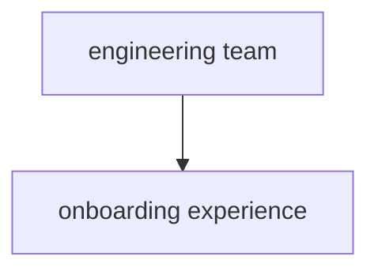

# Dotwork Narrative-to-Ontology Workspace

Transform informal narratives into structured, color-coded ontologies and shareable concept maps. This workspace prevents strategy-execution drift by making relationships between narratives, entities, classifications, and ontologies explicit and queryable.

> *"Plans lose their power the moment strategy and execution drift apart."* — John Cutler

## Features

- 🔍 **Entity Extraction**: Extract entities from narratives using NLP (noun-chunks + custom patterns)
- 🔗 **Relationship Inference**: Infer relationships using linguistic cues and patterns
- 🏷️ **Classification**: Classify entities using a 10-class taxonomy (TimePeriod, Initiative, Outcome, etc.)
- 📊 **Visualization**: Generate Mermaid diagrams for live graphs and documentation
- 📤 **Export**: Export to JSON-LD, GraphML, GEXF, Cytoscape formats
- ⚡ **CLI Tools**: End-to-end workflow processing in < 15 minutes

## Quick Start

```bash
# Install dependencies
npm install

# Build the project
npm run build

# Run with example narrative
npm run example

# Process your own narrative
npm run cli process path/to/narrative.txt

# Run demo
npm run cli demo
```

## Implementation Flow

```text
1. Capture Narrative   – paste, upload or voice-to-text
2. Find the Things     – entity extraction (noun-chunks + custom tags)
3. Understand Relations – edge suggestion with linguistic cues
4. Classify the Things – default taxonomy (Time-Period, Initiative … Principle)
5. Generate Ontology   – graph + JSON-LD / GraphML export
```

## Usage

### CLI Commands

```bash
# Process single narrative
npx dotwork-ontology process narrative.txt -o output/ -f json-ld,mermaid

# Process multiple narratives
npx dotwork-ontology batch narratives/ -o output/ -f graphml

# Run demo with example
npx dotwork-ontology demo -o demo-output/
```

### Programmatic API

```typescript
import { NarrativeProcessor, MermaidRenderer, OntologyExporter } from 'dotwork-narrative-ontology';

const processor = new NarrativeProcessor();
const result = await processor.processNarrative(narrativeText);

// Generate visualizations
const renderer = new MermaidRenderer();
const diagram = renderer.renderOntology(result.ontology);

// Export to formats
const exporter = new OntologyExporter();
const jsonLd = exporter.toJsonLD(result.ontology);
const graphML = exporter.toGraphML(result.ontology);
```

## Default Taxonomy

The system uses a 10-class taxonomy for entity classification:

| Class | Description | Color |
|-------|-------------|-------|
| **TimePeriod** | Temporal boundaries (quarters, years, deadlines) | 🔴 |
| **Initiative** | Strategic programs and organized efforts | 🔵 |
| **Outcome** | Results, achievements, measurable impacts | 🟢 |
| **Stakeholder** | People, teams, organizations involved | 🟡 |
| **Process** | Workflows, procedures, systematic approaches | 🟠 |
| **Resource** | Assets, tools, budget, capabilities | 🟣 |
| **Goal** | Objectives, targets, desired states | 🩷 |
| **Metric** | KPIs and measurements | 🟨 |
| **Insight** | Learnings, discoveries, key findings | 🔷 |
| **Principle** | Guiding values, beliefs, strategic directions | ⚪ |

## Project Structure

```
src/
├── core/           # Domain objects (Narrative, Entity, Relation, Ontology)
├── taxonomy/       # Default 10-class taxonomy
├── extraction/     # Entity and relation extraction
├── pipeline/       # End-to-end processing pipeline
├── ui/            # Mermaid renderer for visualizations
└── export/        # Export to various formats

tools/             # CLI tools
examples/          # Sample narratives and outputs
tests/             # Comprehensive test suite
docs/              # Documentation and ADRs
```

## Development

```bash
# Install dependencies
npm install

# Run tests
npm test

# Run tests with coverage
npm run test

# Lint code
npm run lint

# Type check
npm run typecheck

# Build project
npm run build

# Watch mode for development
npm run dev
```

## Testing

The project includes comprehensive tests covering:

- Unit tests for core components
- Integration tests for the full pipeline
- End-to-end tests with example narratives
- Performance and scalability tests

```bash
# Run all tests
npm test

# Run specific test file
npm test -- --testPathPattern=EntityExtractor

# Run tests with coverage
npm run test -- --coverage
```

## Examples

See the `examples/` directory for sample narratives and their expected ontology outputs:

- **example-01.txt**: Product development narrative with onboarding improvements
- **example-02.txt**: Business performance narrative with financial metrics
- **example-03.txt**: Mobile app redesign project narrative

## Export Formats

### JSON-LD
```json
{
  "@context": {
    "rdfs": "http://www.w3.org/2000/01/rdf-schema#",
    "dotwork": "https://dotwork.com/ontology#"
  },
  "@graph": [
    {
      "@id": "dotwork:engineering_team",
      "@type": "dotwork:stakeholder",
      "rdfs:label": "engineering team"
    }
  ]
}
```

### Mermaid


### GraphML, GEXF, Cytoscape
Full support for graph analysis tools and network visualization platforms.

## Contributing

1. Follow the coding conventions established in the codebase
2. Write tests for new functionality
3. Update documentation as needed
4. Ensure all tests pass and linting is clean

## License

MIT License - see LICENSE file for details.

## Strategic Workflow

```text
Strategic Intent → Investment Agreement → Customer Outcomes → Measurement
          ▲                                        |
          └─────────────── Feedback ───────────────┘
```

Each library change should answer: *"Which step does this accelerate or improve?"*